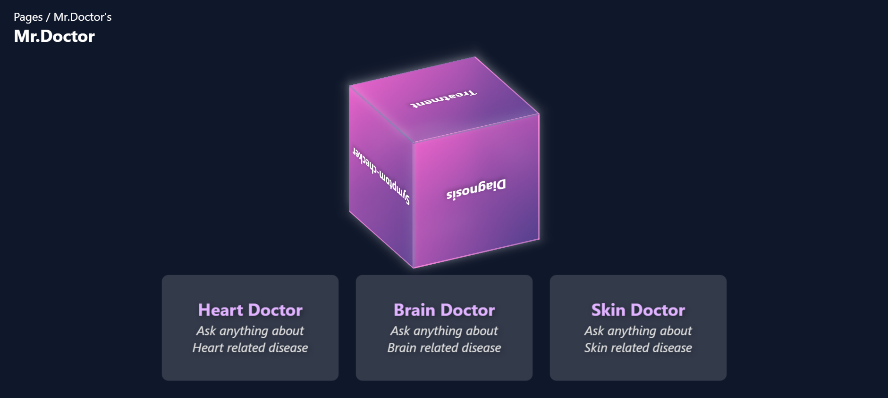

# Mr.Doctor: A (Cardio+Neuro+Dermato)logist 🏥🤖

## Overview 📌
Mr.Doctor is an AI-powered medical chatbot specializing in cardiology, neurology, and dermatology. It utilizes **LLaMA 2**, a Large Language Model (LLM) by Meta, fine-tuned on medical healthcare data sourced from Kaggle. This project was developed for **Err404 6.0**, a Hackathon organized by the **Programmer's Club, M.H. Saboo Siddik College Of Engineering** on **15th Feb 2025**.

## 🔗 Access Mr.Doctor
[Click here to use Mr.Doctor](https://kaiftokare19.github.io/AI-MCA/)

## Features ✨
- **🤖 AI-Powered Chatbot**: Uses LLaMA 2 to provide medical assistance.
- **📊 Fine-Tuned Model**: Trained on real-world medical datasets.
- **💻 Multiple Front-End Implementations**:
  - **HTML, CSS, JavaScript** (Vanilla Front-End)
- **🔧 Backend Model Hosting**:
  - Hosted LLaMA 2 on a dedicated server.
  - API key generated via **Ngrok** for seamless integration.
- **📱 Cross-Platform Compatibility**:
  - Works on both **mobile and desktop devices** using Ngrok tunneling.

## 🛠 Tech Stack
- **Frontend**: HTML, CSS, JavaScript / Next.js
- **Backend**: LLaMA 2 model hosted on a server
- **API Integration**: Ngrok for secure tunneling
- **Data Source**: Medical datasets from Kaggle

## 🎯 Usage
1. Open the frontend application.
2. Enter your symptoms or medical queries.
3. The chatbot will respond based on its trained medical knowledge.
4. Works on both PC and mobile devices.

## 🤝 Contributors
- **CoffeeCode**
- Developed for **Err404 6.0 Hackathon**

## 📜 License
MIT License

---

**⚠️ Note**: Mr.Doctor is an experimental project and should not be used as a substitute for professional medical advice.
