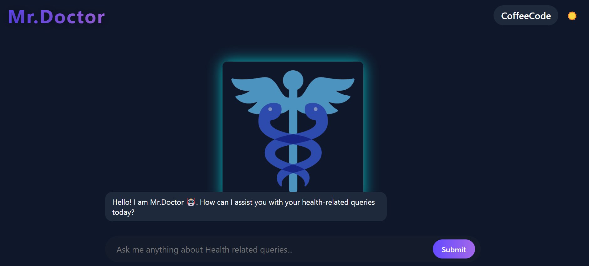
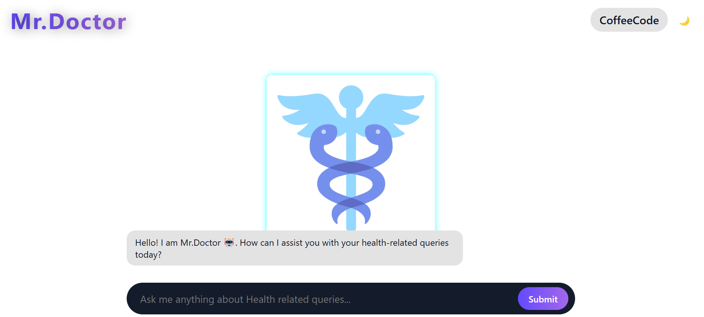

# Mr.Doctor: A (Cardio+Neuro+Dermato)logist 🏥🤖

## Overview 📌
Mr.Doctor is an AI-powered medical chatbot specializing in cardiology, neurology, and dermatology. It utilizes **LLaMA 2**, a Large Language Model (LLM) by Meta, fine-tuned on medical healthcare data sourced from Kaggle. This project was developed for **Err404 6.0**, a Hackathon organized by the **Programmer's Club, M.H. Saboo Siddik College Of Engineering** on **15th Feb 2025**.

## 📷 Project Screenshot




## 🔗 Access Mr.Doctor
[Click here to use Mr.Doctor](https://kaiftokare19.github.io/AI-MCA/)

## Features ✨
- **🤖 AI-Powered Chatbot**: Uses LLaMA 2 to provide medical assistance.
- **📊 Fine-Tuned Model**: Trained on real-world medical datasets.
- **💻 Multiple Front-End Implementations**:
  - **HTML, CSS, JavaScript** (Vanilla Front-End)
  - **Next.js** (React-Based Modern Web App)
- **🔧 Backend Model Hosting**:
  - Hosted LLaMA 2 on a dedicated server.
  - API key generated via **Ngrok** for seamless integration.
- **📱 Cross-Platform Compatibility**:
  - Works on both **mobile and desktop devices** using Ngrok tunneling.

## 🛠 Tech Stack
- **Frontend**: HTML, CSS, JavaScript / Next.js
- **Backend**: LLaMA 2 model hosted on a server
- **API Integration**: Ngrok for secure tunneling
- **Data Source**: Medical datasets from Kaggle

## 🚀 Setup & Installation
### 1️⃣ Clone the Repository
```sh
git clone https://github.com/your-repo/mr-doctor.git
cd mr-doctor
```

### 2️⃣ Setting Up Backend (LLaMA 2 Server)
- Host the **LLaMA 2 model** on a dedicated server.
- Use **Ngrok** to generate an API key.
```sh
ngrok http 8000
```
- Note the API endpoint generated.

### 3️⃣ Frontend Configuration
#### Using Vanilla JS
- Open `index.html` and replace the API URL in `script.js`:
```js
const API_URL = "YOUR_NGROK_API_URL";
```
- Run it in any web browser.

#### Using Next.js
- Navigate to the Next.js frontend directory:
```sh
cd frontend-nextjs
npm install
npm run dev
```

## 🎯 Usage
1. Open the frontend application.
2. Enter your symptoms or medical queries.
3. The chatbot will respond based on its trained medical knowledge.
4. Works on both PC and mobile devices.

## 🤝 Contributors
- **Your Team Name**
- Developed for **Err404 6.0 Hackathon**

## 📜 License
MIT License

---

**⚠️ Note**: Mr.Doctor is an experimental project and should not be used as a substitute for professional medical advice.
